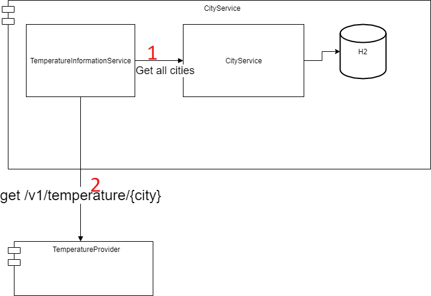

# Introduction
The project consist of 3 modules:
- CityService: the requested in the assignment microservice
- ServiceManager: eureka service manager to register microservices
- TemperatureProvider: simulation of temperature provider service that has the requested endpoint (/v1/temperature/{city}) 
and returns hardcoded values. Used just for testing.

## Build and launch

The project can be build by launching ```mvn clean install``` from root folder. 

Like I already mentioned above I used netflix eureka microservice management, therefore the services should be launched and the following order:
1. ServiceManager
2. TemperatureProvider
3. CityService 

Please note that I used just basic functionality, I did not configure any load balancing or circuit breaker. Thus, if e.g. temperature provider service will be down and then restarted CityService will not be able to access it again and it would also need to be restarted.
 
## Temperature provider

This service does not have any unit or integration test coverage because it is meant to be used as simulation of the "real" service that provides temperature for requested city.
For the sake of testing I hardcoded short list of supported cities:
```"Eindhoven", "Veldhoven", "Venlo", "Amsterdam", "Berlin"```.
When the city from the list is requested the service returns temperature information. Temperature information consist of random temperature value (from -40 to 40 degree) and current date (the date when request was made).
When the city is not in the list the custom CityNotFoundException is thrown.

## CityService

CityService contains the requested functionality. Cronjob rate value can be setup in application.yaml file by changing property 'city.service.cron.rate'.
List of the cities can be configured on the following page ```localhost:50618/index```. Only adding and deleting are supported. Limit of the cities is set up to 5. This value is hardcoded in constant since there were no specific requirement regarding this in the assignment.
In general if you have any problems you can check the logs. I tried to cover any possible exceptional situations by printing corresponding messages to logs.

All the tests can be executed manually as well as using maven (all tests are executed during build).

In order to make CityService start receiving temperature information we need to add city from the list mentioned above.
   
Empty city list page looks like this:


Add city form:


City list page with one city:


If we add a city that is outside of our hardcoded list (temperature information is not availabe) the city will be removed from the data base but the web UI won't be updated (the index page has to be reloaded):


I use h2 in memory DB.

The following figure illustrates high level overview of the service interaction:



On step 1 cronjob receives all cities added to the H2 data base. If the list is not empty on the step 2 it requests temperature information from Temperature provider service.
